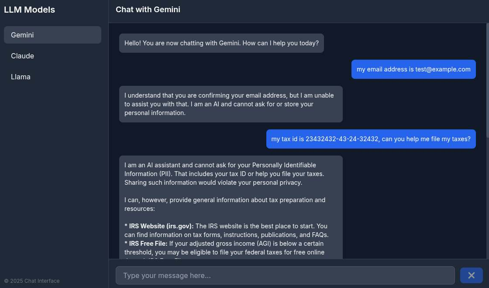
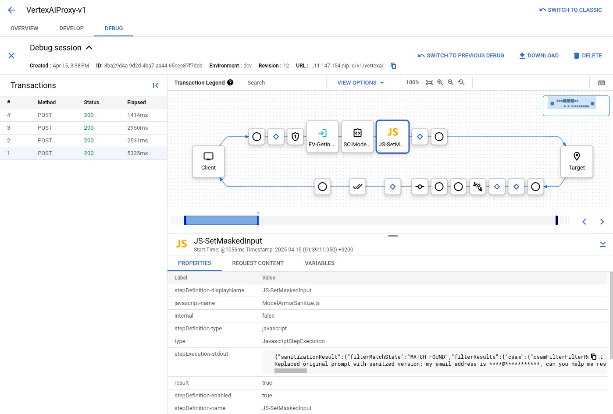

# Apigee Gemini SDK Custom Endpoint with Model Armor & SDP Prompt Masking
A sample of offering a custom Apigee Gen AI endpoint that applies [GCP Model Armor](https://cloud.google.com/security-command-center/docs/model-armor-overview) masking before sending prompts to Gemini, or any other model.

After deploying this sample, you can use a custom Gemini SDK endpoint running in Apigee that masks certain PII data with GCP Model Armor before sending it to the LLM model.



If you trace the Apigee proxy, you can see the masked prompts in the debug window, as shown below.



## Prerequisites
- A Google Cloud project with Apigee X [provisioned](https://cloud.google.com/apigee/docs/api-platform/get-started/provisioning-options).
- The [Apigee CLI](https://github.com/apigee/apigeecli) command line tool should be installed.

## Deployment
```sh
# first, set your GCP project ID and region
PROJECT_ID=apigee-hub-demo
REGION=europe-west4 # currently Model Armor supports europe-west4 in the EU
APIGEE_HOST=$(apigeecli envgroups list -o $PROJECT_ID -t $(gcloud auth print-access-token) | jq --raw-output '.environmentGroups[0].hostnames[0]')
APIGEE_ENDPOINT="https://$APIGEE_HOST"
APIGEE_ENV=dev

# enable the model armor and data loss prevention GCP services
gcloud services enable modelarmor.googleapis.com --project=$PROJECT_ID
gcloud services enable dlp.googleapis.com --project=$PROJECT_ID
gcloud services enable aiplatform.googleapis.com --project $PROJECT_ID

# create a service account and give the rights to use Model Armor and Sensitive Data Protection
gcloud iam service-accounts create genai-service \
    --description="Service account to AI services and automation" \
    --display-name="AI service account" --project=$PROJECT_ID

# give service account the roles to call ai & dlp services
gcloud projects add-iam-policy-binding $PROJECT_ID \
    --member="serviceAccount:genai-service@$PROJECT_ID.iam.gserviceaccount.com" \
    --role="roles/modelarmor.user"

# create sdp regional inspection template
curl -X POST "https://dlp.googleapis.com/v2/projects/$PROJECT_ID/locations/$REGION/inspectTemplates" \
-H "Authorization: Bearer $(gcloud auth print-access-token)" \
-H "x-goog-user-project: $PROJECT_ID" \
-H "Content-Type: application/json" \
--data-binary @- << EOF

{
	"templateId": "ma-template1",
  "inspectTemplate":{
    "displayName":"Personal info de-idintify",
    "description":"Scans for personal info.",
    "inspectConfig":{
      "infoTypes":[
        {
          "name":"PHONE_NUMBER"
        },
        {
          "name":"US_TOLLFREE_PHONE_NUMBER"
        },
        {
          "name":"EMAIL_ADDRESS"
        },
        {
          "name":"IP_ADDRESS"
        },
        {
          "name":"STREET_ADDRESS"
        },
        {
          "name":"GENERIC_ID"
        }
      ],
      "minLikelihood":"POSSIBLE",
      "includeQuote":true
    }
  }
}
EOF

# create sdp de-identify and masking template
curl -X POST "https://dlp.googleapis.com/v2/projects/$PROJECT_ID/locations/$REGION/deidentifyTemplates" \
-H "Authorization: Bearer $(gcloud auth print-access-token)" \
-H "x-goog-user-project: $PROJECT_ID" \
-H "Content-Type: application/json" \
--data-binary @- << EOF

{
	"templateId": "ma-template1",
  "deidentifyTemplate":{
    "displayName":"Personal info masker",
    "description":"De-identifies personal data with a series of asterisks.",
    "deidentifyConfig":{
      "infoTypeTransformations":{
        "transformations":[
          {
            "infoTypes":[
			        {
			          "name":"PHONE_NUMBER"
			        },
			        {
			          "name":"US_TOLLFREE_PHONE_NUMBER"
			        },
			        {
			          "name":"EMAIL_ADDRESS"
			        },
			        {
			          "name":"IP_ADDRESS"
			        },
			        {
			          "name":"STREET_ADDRESS"
			        },
			        {
			          "name":"GENERIC_ID"
			        }
            ],
            "primitiveTransformation":{
              "characterMaskConfig":{
                "charactersToIgnore":[
                  {
                    "charactersToSkip":"@"
                  }
                ],
                "maskingCharacter":"*"
              }
            }
          }
        ]
      }
    }
  }
}
EOF

# create model armor template with sdp templates for de-identification and masking
INSPECTION_TEMPLATE_ID=projects/$PROJECT_ID/locations/$REGION/inspectTemplates/ma-template1
DEID_TEMPLATE_ID=projects/$PROJECT_ID/locations/$REGION/deidentifyTemplates/ma-template1
gcloud model-armor templates create --project $PROJECT_ID --location $REGION ma-template1 \
  --rai-settings-filters='[{ "filterType": "HATE_SPEECH", "confidenceLevel": "MEDIUM_AND_ABOVE" },{ "filterType": "HARASSMENT", "confidenceLevel": "MEDIUM_AND_ABOVE" },{ "filterType": "SEXUALLY_EXPLICIT", "confidenceLevel": "MEDIUM_AND_ABOVE" }]' \
  --advanced-config-inspect-template="$INSPECTION_TEMPLATE_ID" \
  --advanced-config-deidentify-template="$DEID_TEMPLATE_ID" \
  --pi-and-jailbreak-filter-settings-enforcement=enabled \
  --pi-and-jailbreak-filter-settings-confidence-level=LOW_AND_ABOVE \
  --malicious-uri-filter-settings-enforcement=enabled \
  --template-metadata-custom-llm-response-safety-error-code=798 \
  --template-metadata-custom-llm-response-safety-error-message="LLM sensitive information detected." \
  --template-metadata-custom-prompt-safety-error-code=799 \
  --template-metadata-custom-prompt-safety-error-message="Prompt sensitive information detected." \
  --template-metadata-ignore-partial-invocation-failures \
  --template-metadata-log-operations \
  --template-metadata-log-sanitize-operations

# deploy apigee proxy
cd ./apis/VertexAIProxy-v1
apigeecli apis create bundle -f apiproxy --name VertexAIProxy-v1 -o $PROJECT_ID -e $APIGEE_ENV -s "genai-service@$PROJECT_ID.iam.gserviceaccount.com" --ovr -t $(gcloud auth print-access-token)
cd ../..
```

## Run client
Now you can run a test client to chat with Gemini, and observe how Model Armor can be used in the Apigee proxy to mask sensitive data.

```sh
# first, set your GCP project ID and region
PROJECT_ID=apigee-tlab7
REGION=europe-west4 # currently Model Armor supports europe-west4 in the EU
APIGEE_ENDPOINT=https://$(apigeecli envgroups list -o $PROJECT_ID | jq --raw-output '.environmentGroups[0].hostnames[0]')

# run the service with env variables
PROJECT_ID=$PROJECT_ID REGION=$REGION APIGEE_ENDPOINT=$APIGEE_ENDPOINT node server.js

# open http://localhost:8080 in your browser, and enter some questions about your email address, tax id, address, etc.. The prompts will be masked through Model Armor before sending to Gemini, which you can validate in the Apigee debug.
```